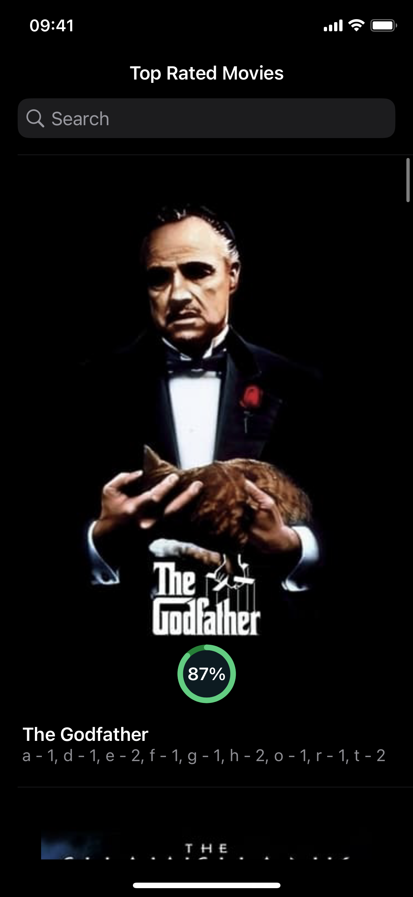
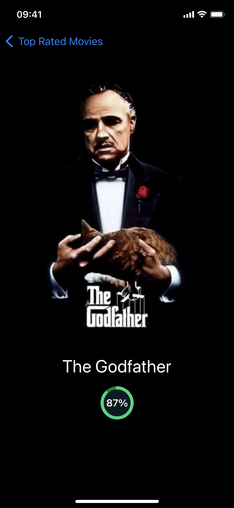

# JatApp. Assignment

## Task
Create an application with a list of movies using TMDB service [API](https://developer.themoviedb.org/docs).

### Conditions that should be met:
- [x] Create a screen with the first 20 results from the list of Top Rated
- [x] Result cell has to contain title, vote average and image
- [x] Cell selection action has to redirect to the next screen
- [x] Count the occurrence of each character in the title that you have received before and display results using any UI component
- [x] Display results using any UI component (for example UITableView or UICollectionView)

### Important notes
- Everything should be done without third-party libs
- UI can be very simple but should be responsive, precise, accurate and done according to guidelines

### Will be a plus
- [x] Response data local cache
- [x] Image cache
- [x] Any tests
- [x] Pull-to-Refresh
- [ ] Custom transition between screens
- [x] Local search
- [ ] Remote search

## Demonstration

  
  
  

## Prerequisites
- Xcode 15+: I'm using `ASSETCATALOG_COMPILER_GENERATE_ASSET_SYMBOLS` setting
- iOS 16+: as far as I know that's a common practice to support the last two versions of iOS (unless otherwise stated)

## Developer's notes

### API
- API layer contains main `HTTPClient` protocol which I'm utilizing in the composition root (`SceneDelegate`). As well as `Decorator` pattern to wrap the `URLSessionHTTPClient` class in order not to pollute requests with authorization details
- Just for simplicity from the interviewer's side I decided to "sew up" the access token right in the program's `AuthorizedHTTPClient` component
- Each endpoint I split to two components: a request and a mapper (this way I was trying to follow the `SRP` principle)

### Architecture of the feature
- I was trying to accomplish this task using `Dependency Injection` as the best pattern in my opinion and cover concrete implementations with appropriate protocols
- **Why not `MVC`?**. Because the view controller already contains too much logic such as: configuring itself, table view etc.; responds to different table view and search data sources and delegates
- **Why `MVP` and not `MVVM` or something else?**. `VIPER`+ would be too much for this simple application. Between `MVP` and `MVVM` I decided to choose `MVP` because on this vacancy there's a clear mention about `MVP` and I wanted to show you my ability to work with this pattern
- **Navigation**. In order to decouple the `TopRatedMoviesViewController` from specific detail view controller, I decided to create the `onSelect` closure and pass this decision to the composition root

### Persistence
- Contains `ImageCache` protocol
- In this application I've implemented the `ImageCache` protocol using the `NSCache` class which is called `InMemoryImageCache`
- But it can be very easy to implement, let's say `FileManagerImageCache` to store the cache in a long term memory storage

### Presentation
- Vast majority of the project is made on `UIKit` without storyboards. However, I don't mind to use them. Depends on a team's preferences
- Detail screen is made using `SwiftUI` with a `UIViewRepresentable` component (`UserScoreRatingView`) which was used in the `UIKit`'s version
- In this project I don't pay any attention to the error handling on UI. However, it wouldn't be much effort to fulfill UI with it if there will be such a task

## Bugs
> **Note.**
> I have to mention that I've discovered at least one bug that I couldn't fix quickly. If on a clean device press very fast on the search and start typing - it can crash with the `Index out of bounds exceptions` or start consuming a lot of RAM.
